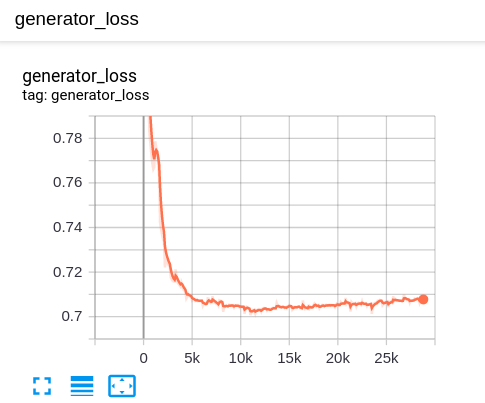
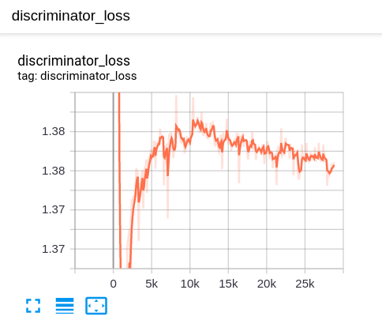
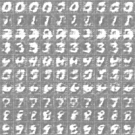

# CGAN-MNIST
Try to use Condition Generative Adversrial Network(CGAN) to generate images of hand written digits


## Usage

* Download data
```shell script
cd tools/
python download.py mnist
```
* Train
```shell script

```
* Test
```shell script

```
* Visualize
```shell script

```

## Train Logs

```
dropout_rate = 0.3
generator_learning_rate = 1e-4
discriminator_learning_rate = 4e-4
epoch = 50
```

 |  |
|:-------------------------:|:-------------------------:|
Displayed generator Loss on Tensorboard | Displayed discriminator Loss on Tensorboard | 

 |
|:-------------------------:|
every epoch generator result of training | 


## TOTO


## Reference code
* <https://github.com/zhangqianhui/Conditional-GAN>


